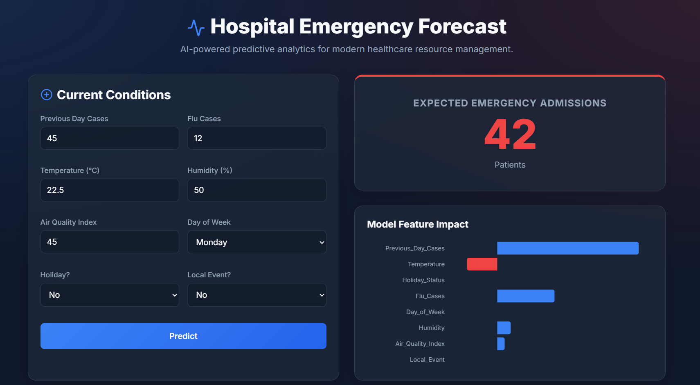

# hospital-emergency-prediction
A machine learning project using Linear Regression and Streamlit to predict hospital emergency admissions based on healthcare data.

# 🏥 Hospital Emergency Prediction System



## 📌 Overview
The **Hospital Emergency Prediction System** is a machine learning-powered web application developed to predict the number of emergency patient admissions in hospitals.

This project uses **Linear Regression** to forecast emergency cases based on healthcare-related parameters such as previous day admissions, temperature, holiday status, and flu cases.

It is designed to assist hospitals in **resource planning, emergency preparedness, and efficient patient care management**.

---

## 🎯 Objective
To build a predictive analytics system that estimates hospital emergency admissions using machine learning techniques.

---

## 🛠️ Technologies Used
- 🐍 Python
- 📊 Pandas
- 🔢 NumPy
- 🤖 Scikit-learn
- 📈 Matplotlib
- 🌐 Streamlit

---

## 🧠 Machine Learning Algorithm
### 📍 Linear Regression

The model follows the equation:

y = \beta_0 + \beta_1x_1 + \beta_2x_2 + \beta_3x_3 + \beta_4x_4 + \beta_5x_5 + \beta_6x_6 + \beta_7x_7 + \beta_8x_8

Where:
- **y** → Predicted emergency cases
- **x₁** → Previous day cases
- **x₂** → Temperature
- **x₃** → Holiday status
- **x₄** → Flu cases
- **x₅** → Day of the week
- **x₆** → Humidity
- **x₇** → Air Quality Index (AQI)
- **x₈** → Local Event Status

---

## ✨ Features
- 📈 Predicts hospital emergency admissions
- 💻 Interactive GUI built with Streamlit
- ⚡ Real-time user input and instant prediction
- 📋 Dataset preview table
- 📊 Trend visualization using graphs
- 🧾 Clean and user-friendly dashboard

---

## 📂 Project Structure

```text
hospital-emergency-prediction/
│
├── app.py                     # Main landing page
├── utils.py                   # Shared data loading & model training
├── generate_data.py           # Synthetic dataset generator
├── dataset.csv                # Historical data
├── requirements.txt           # Dependencies
├── README.md                  # Project documentation
│
└── pages/                     # Multi-page dashboard
    ├── 1_🔮_Predictor.py      # Emergency admissions prediction form
    ├── 2_📊_Dashboard.py      # Interactive charts and trends
    └── 3_📚_Dataset.py        # Raw data viewer and exporter
```

---

## 📝 Input Parameters
The model takes the following inputs:

- 🏥 Previous Day Cases
- 🤒 Flu Cases
- 🌡️ Temperature
- 💧 Humidity
- 🌫️ Air Quality Index
- 📅 Day of the Week
- 🎉 Holiday Status
- 🎟️ Local Event Status

---

## 🎯 Output
- 📌 Predicted number of hospital emergency admissions

---

## ▶️ How to Run the Project

This is a modern Full-Stack application. You need to run both the Python Backend API and the React Frontend Website.

### 1️⃣ Start the Backend API (Python)
Open a terminal in the root project folder:
```bash
.\.venv\Scripts\python api.py
```
This will start the machine learning server on `http://localhost:5000`.

### 2️⃣ Start the Frontend Website (React)
Open a **new** terminal, navigate to the frontend folder, and start Vite:
```bash
cd frontend
npm run dev
```
This will start the beautiful website on `http://localhost:5173`.

---

## 💡 Applications
This system can help hospitals in:

- 👩‍⚕️ Doctor and nurse scheduling
- 🛏️ Emergency bed allocation
- 💊 Medicine stock preparation
- 🚑 Emergency response planning
- 📅 Daily hospital resource management

---

## 🚀 Future Enhancements
- 🌍 Use real-world hospital datasets
- 🤖 Implement advanced ML models (Random Forest / XGBoost)
- ☁️ Deploy as a live web application
- 📊 Add advanced dashboards and analytics
- 🔗 Integrate with hospital databases

---

## 👩‍💻 Developed By
**Lakshana**  
🎓 B.Tech – Artificial Intelligence and Data Science  
📚 Mini Project – Machine Learning
